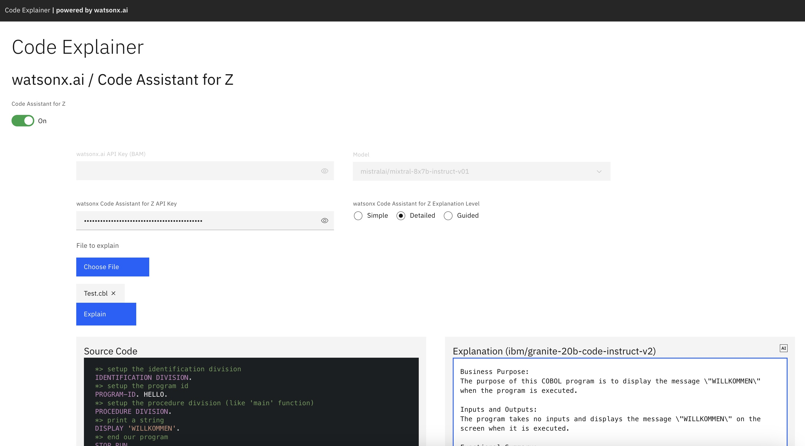
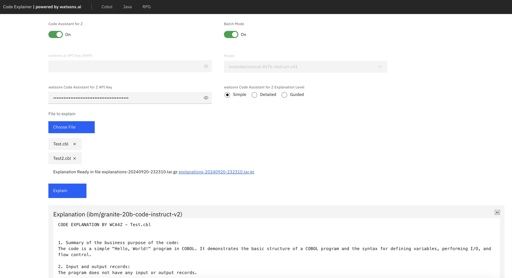

# Code Explainer powered by watsonx.ai

This repo contains a full-stack application for a Code Explainer built with React for the frontend and FastAPI in Python for the backend. The application utilizes the power of **watsonx.ai** and **watsonx Code Assistant**. In this specific instance, we employ one of the code fine-tuned Language Models (LLM) to generate code explanation.



## Features

- Explain code in plain english - Focus on COBOL 
- Utilizes Language Models on watsonx.ai (Mistral Large, Granite) and  watsonx Code Assistant for Z (Granite) model
- Responsive and user-friendly web interface built with React and Carbon Design.
- Scalable FastAPI backend to handle translation requests.
- Easy-to-use and deployable monorepo structure.

## Batch mode (tech preview)



- Triggered selecting multiple files, generates a tar file with your explanations. Works with WCAZ only for now.

## Installation

Before getting started, ensure that you have Node.js and Python installed on your system.

1. Clone the repository:

   ```bash
   git clone <URL>
   cd code-explainer
   ```

2. Install frontend dependencies:

   ```bash
   cd frontend
   yarn install
   ```

3. Install backend dependencies:

   ```bash
   cd ../backend
   pip install -r requirements.txt
   ```

## Usage

1. Start the FastAPI backend:

   ```bash
   cd backend
   python main.py
   ```

2. Start the React frontend:

   ```bash
   cd ../frontend
   yarn dev
   ```

3. Access the application in your web browser at `http://localhost:5173`.


## Acknowledgments

- This project utilizes the power of [watsonx.ai](https://watsonx.ai/) for code translation. Currently the internal [BAM version](https://bam.res.ibm.com/) is being used. Therefore, please only use it for internal purposes for now.
- The frontend is built with [React](https://reactjs.org/), [Vite](https://vitejs.dev/) and [Carbon Design System](https://www.carbondesignsystem.com/).
- The backend is powered by [FastAPI](https://fastapi.tiangolo.com/).

- Code inspired from [Code Translator](https://github.ibm.com/Sinan-Oezguen/code-translator/tree/main/frontend) by [sinan.oezguen@ibm.com](mailto:sinan.oezguen@ibm.com).

## Contact

If you have any questions or need assistance, feel free to contact me 

Happy coding! 🚀
